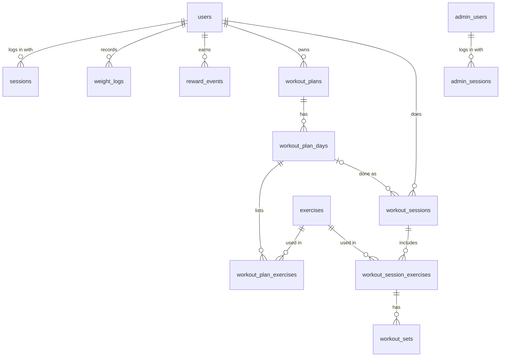

# Database

The backend uses one Cloudflare D1 database, `fitpilot-db`, bound to the worker as `fitpilot_db`. D1 is SQLite, so IDs are `TEXT` (UUIDs), booleans are `INTEGER` 0/1, and timestamps are `TEXT` in UTC (`YYYY-MM-DD HH:MM:SS`).

## Tables at a glance

| Area | Table | Holds |
| --- | --- | --- |
| Users | `users` | Accounts plus profile and onboarding fields |
| Users | `sessions` | User login sessions (access and refresh tokens, hashed) |
| Users | `weight_logs` | Weight entries over time (not written yet, see below) |
| Users | `reward_events` | XP the user has earned, one row per reward |
| Exercises | `exercises` | The exercise library |
| Plans | `workout_plans` | A user's generated plan |
| Plans | `workout_plan_days` | The days in a plan |
| Plans | `workout_plan_exercises` | The exercises on each day, with sets, reps and rest |
| Sessions | `workout_sessions` | A workout the user actually did |
| Sessions | `workout_session_exercises` | The exercises done in a session |
| Sessions | `workout_sets` | Each set recorded for a session exercise |
| Admin | `admin_users` | Admin panel accounts |
| Admin | `admin_sessions` | Admin login sessions |
| Admin | `notification_history` | Broadcast pushes sent from the admin panel |
| Admin | `app_versions` | Latest and minimum app version per platform |

## How the app uses each table

### Users and login

| Table | Written by | Read by |
| --- | --- | --- |
| `users` | Sign-up and Google sign-in (`handlers/auth.ts`); the profile screen, `PUT /profile` (`handlers/profile.ts`) | Workout generation, `/progress`, the admin users page and dashboard |
| `sessions` | Login creates a row, `/auth/refresh` rotates its tokens, logout deletes it | Every request that needs a user token (`services/auth.ts`) |
| `weight_logs` | Nothing yet (see [Known gap](#known-gap-weight_logs-is-never-written)) | The weight chart on `/progress` |
| `reward_events` | Completing a workout, `POST /workouts/sessions/:id/complete` (`services/rewards.ts`) | The XP summary on `/progress` |

### Exercise library

| Table | Written by | Read by |
| --- | --- | --- |
| `exercises` | The admin exercises page (`handlers/admin-exercises.ts`) | The app's `/exercises` list and detail, workout plan generation, and adding exercises to plans and sessions |

### Workout plans: what the user should do

`workout_plans` → `workout_plan_days` → `workout_plan_exercises`

- **Written by** `POST /workouts/generate` and `POST /workouts/regenerate`, which build a plan from the user's profile. `POST /workouts/:id/days/:dayId/exercises` adds an exercise to a day.
- **Read by** `GET /workouts`, `GET /workouts/:id` and `GET /workouts/today`.
- The app always works from the plan with `status = 'active'`.

All plan code is in `handlers/workouts.ts`.

### Workout sessions: what the user actually did

`workout_sessions` → `workout_session_exercises` → `workout_sets`

During a workout, the app makes these calls:

1. `POST /workouts/sessions` creates a `workout_sessions` row with `status = 'started'`.
2. `POST /workouts/sessions/:id/exercises` adds a `workout_session_exercises` row.
3. `POST /workouts/sessions/:id/sets` adds a `workout_sets` row for each set.
4. `POST /workouts/sessions/:id/complete` sets `status = 'completed'`, with duration and calories, then awards XP into `reward_events` (see [Rewards and XP](#rewards-and-xp)).

Only completed sessions count towards these screens:

| Screen | Endpoint | What it takes from `workout_sessions` |
| --- | --- | --- |
| Progress | `/progress` | Workout count, calories and activity bars for the week, month or year |
| Streak | `/progress`, `/workouts/stats` | Consecutive days (UTC) with a completed session, counting back from today, or from yesterday if there's none today yet |
| Home stats | `/workouts/stats`, `/workouts/weekly-progress` | Totals and which days this week had a workout |
| Admin dashboard | `/admin/dashboard`, `/admin/analytics` | Workouts today, this week and per day |
| Admin workouts | `/admin/workouts` | Every session, with its user's name and email |

### Admin panel

| Table | Written by | Read by |
| --- | --- | --- |
| `admin_users` | `POST /admin/setup` (first admin only) | Admin login |
| `admin_sessions` | Admin login creates a row, admin logout deletes it | Every `/admin/*` request (`services/admin-auth.ts`) |
| `notification_history` | `POST /admin/notifications/send`, after the push goes out | The admin history page, and the app's `/notifications` inbox |
| `app_versions` | The admin app versions page, `PUT /admin/app-versions/:platform` | The app's launch check, `GET /app/version` |

### How `/progress` builds its numbers

`getProgress` in `handlers/progress.ts` combines three tables:

| Part of the response | Source |
| --- | --- |
| `stats.totalWorkouts`, `calories`, `activity` | `workout_sessions` rows with `status = 'completed'` whose start date falls in the period |
| `stats.currentStreak` | Dates of all completed `workout_sessions` |
| `weight.points`, `weight.delta` | `weight_logs` in the period; if there are none, a single "Now" point |
| `weight.current` | The latest `weight_logs` entry, else `users.weight_kg` |
| `rewards.totalXp`, `rewards.totalRewards` | Sum and count of all the user's `reward_events` (all time, not just the period) |
| `rewards.history` | The user's 10 most recent `reward_events` |

### Rewards and XP

When a workout is completed, `awardWorkoutRewards` in `services/rewards.ts` adds rows to `reward_events`:

| Reward | `event_type` | `event_key` | XP | How often |
| --- | --- | --- | --- | --- |
| Workout completed | `workout_completed` | `workout:<sessionId>` | 20 | Every completed session, so two workouts in one day earn 40 |
| 3-day streak | `streak_milestone` | `streak:3` | 50 | Once per user, ever |
| 7-day streak | `streak_milestone` | `streak:7` | 150 | Once per user, ever |
| 30-day streak | `streak_milestone` | `streak:30` | 500 | Once per user, ever |
| 100-day streak | `streak_milestone` | `streak:100` | 2000 | Once per user, ever |

The table has a unique constraint on (`user_id`, `event_key`), and inserts use `INSERT OR IGNORE`, so the same reward can't be given twice. That's also why streak bonuses are one-time: a user who loses a 7-day streak and rebuilds it gets no second 150 XP. The streak is checked right after the session is marked completed, using the same count as `/progress`.

The XP earned is returned in the complete response as `rewards` and `totalXpEarned`, and totals appear on `/progress` under `rewards`. The XP amounts live in code, not the database: `DAILY_WORKOUT_XP` and `STREAK_REWARDS` in `services/rewards.ts`.

### Known gap: `weight_logs` is never written

No code inserts into `weight_logs`; changing weight on the profile only updates `users.weight_kg`. So the progress weight chart always shows the single "Now" point, and `weight.delta` is always 0. The usual fix is to also add a `weight_logs` row whenever `PUT /profile` changes `weightKg`.

## Relationships



A plan describes what the user should do; a session records what they actually did. A session can link to the plan day it came from, but doesn't have to.

**What happens on delete**
- Deleting a user deletes their sessions, weight logs, reward events, plans and workout sessions (`ON DELETE CASCADE`).
- Deleting a plan deletes its days, and deleting a day deletes its exercises.
- Deleting a plan day keeps any workout sessions done from it, with `workout_plan_day_id` set to NULL.
- An exercise used in any plan or session can't be deleted (`ON DELETE RESTRICT`). Admins deactivate it instead, by setting `is_active = 0`.

`notification_history.sent_by` stores an admin ID, but there is no foreign key on it.

## Tables

### users

| Column | Type | Notes |
| --- | --- | --- |
| `id` | TEXT PK | |
| `email` | TEXT | Unique |
| `password_hash` | TEXT | PBKDF2. Google-only accounts hold the placeholder `!google`, so no password login is possible |
| `google_id` | TEXT | Google `sub` claim, unique; NULL for email accounts |
| `name`, `avatar_url` | TEXT | |
| `date_of_birth`, `gender`, `age` | TEXT / TEXT / INTEGER | |
| `height_cm`, `weight_kg` | REAL | |
| `goal`, `activity_level` | TEXT | |
| `workout_days` | INTEGER | Days per week the user wants to train |
| `reminders_enabled` | INTEGER | Default 1 |
| `onboarding_completed` | INTEGER | Default 0 |
| `created_at`, `updated_at` | TEXT | |

### sessions (user logins)

| Column | Type | Notes |
| --- | --- | --- |
| `id` | TEXT PK | |
| `user_id` | TEXT | → `users.id`, cascade |
| `token_hash` | TEXT | SHA-256 of the access token, unique. Tokens are never stored raw |
| `expires_at` | TEXT | Access token expiry (7 days) |
| `refresh_token_hash` | TEXT | Unique |
| `refresh_expires_at` | TEXT | Refresh token expiry (30 days) |
| `created_at` | TEXT | |

### weight_logs

| Column | Type | Notes |
| --- | --- | --- |
| `id` | TEXT PK | |
| `user_id` | TEXT | → `users.id`, cascade |
| `weight_kg` | REAL | Required |
| `recorded_at`, `created_at` | TEXT | |

### reward_events

| Column | Type | Notes |
| --- | --- | --- |
| `id` | TEXT PK | |
| `user_id` | TEXT | → `users.id`, cascade |
| `event_key` | TEXT | `workout:<sessionId>` or `streak:<days>`; unique per user |
| `event_type` | TEXT | `workout_completed` or `streak_milestone` |
| `xp` | INTEGER | Must be greater than 0 |
| `created_at` | TEXT | |

### exercises

| Column | Type | Notes |
| --- | --- | --- |
| `id` | TEXT PK | e.g. `ex_chest_001` |
| `name` | TEXT | |
| `slug` | TEXT | Unique |
| `description`, `instructions` | TEXT | |
| `category` | TEXT | e.g. `strength` |
| `muscle_group` | TEXT | Lowercase with hyphens, e.g. `full-body` |
| `equipment` | TEXT | e.g. `dumbbell` |
| `difficulty` | TEXT | e.g. `beginner` |
| `image_url`, `video_url` | TEXT | |
| `is_active` | INTEGER | 1 = shown in the app, 0 = deactivated |
| `created_at`, `updated_at` | TEXT | |

### workout_plans

| Column | Type | Notes |
| --- | --- | --- |
| `id` | TEXT PK | |
| `user_id` | TEXT | → `users.id`, cascade |
| `name`, `description` | TEXT | |
| `goal` | TEXT | |
| `days_per_week`, `duration_weeks` | INTEGER | |
| `status` | TEXT | Default `active`; the app works from the user's active plan |
| `started_at`, `ended_at` | TEXT | |
| `created_at`, `updated_at` | TEXT | |

### workout_plan_days

| Column | Type | Notes |
| --- | --- | --- |
| `id` | TEXT PK | |
| `workout_plan_id` | TEXT | → `workout_plans.id`, cascade |
| `day_number` | INTEGER | |
| `day_name`, `title`, `description` | TEXT | |
| `rest_day` | INTEGER | 1 = rest day |
| `created_at` | TEXT | |

### workout_plan_exercises

| Column | Type | Notes |
| --- | --- | --- |
| `id` | TEXT PK | |
| `workout_plan_day_id` | TEXT | → `workout_plan_days.id`, cascade |
| `exercise_id` | TEXT | → `exercises.id`, restrict |
| `exercise_order` | INTEGER | Position in the day |
| `sets`, `reps` | INTEGER | |
| `duration_seconds` | INTEGER | For timed exercises |
| `rest_seconds` | INTEGER | New plans use 45 |
| `target_weight_kg` | REAL | |
| `notes` | TEXT | |
| `created_at` | TEXT | |

### workout_sessions

| Column | Type | Notes |
| --- | --- | --- |
| `id` | TEXT PK | |
| `user_id` | TEXT | → `users.id`, cascade |
| `workout_plan_day_id` | TEXT | → `workout_plan_days.id`, set NULL; optional |
| `status` | TEXT | `started` → `completed` |
| `started_at`, `completed_at` | TEXT | |
| `duration_seconds` | INTEGER | |
| `calories_burned` | REAL | |
| `notes` | TEXT | |
| `created_at` | TEXT | |

### workout_session_exercises

| Column | Type | Notes |
| --- | --- | --- |
| `id` | TEXT PK | |
| `workout_session_id` | TEXT | → `workout_sessions.id`, cascade |
| `exercise_id` | TEXT | → `exercises.id`, restrict |
| `exercise_order` | INTEGER | |
| `created_at` | TEXT | |

### workout_sets

| Column | Type | Notes |
| --- | --- | --- |
| `id` | TEXT PK | |
| `workout_session_exercise_id` | TEXT | → `workout_session_exercises.id`, cascade |
| `set_number` | INTEGER | |
| `reps` | INTEGER | |
| `weight_kg` | REAL | |
| `duration_seconds` | INTEGER | |
| `distance_meters` | REAL | |
| `completed` | INTEGER | Default 1 |
| `created_at` | TEXT | |

### admin_users

| Column | Type | Notes |
| --- | --- | --- |
| `id` | TEXT PK | |
| `email` | TEXT | Unique |
| `password_hash` | TEXT | PBKDF2 |
| `name` | TEXT | |
| `created_at`, `updated_at` | TEXT | |

### admin_sessions

| Column | Type | Notes |
| --- | --- | --- |
| `id` | TEXT PK | |
| `admin_id` | TEXT | → `admin_users.id`, cascade |
| `token_hash` | TEXT | SHA-256 of the admin token, unique |
| `expires_at` | TEXT | 7 days after login |
| `created_at` | TEXT | |

### notification_history

| Column | Type | Notes |
| --- | --- | --- |
| `id` | TEXT PK | |
| `title` | TEXT | Max 100 characters (checked in code) |
| `message` | TEXT | Max 1000 characters (checked in code) |
| `audience` | TEXT | Always `all` today |
| `status` | TEXT | `sent` for every row written today |
| `onesignal_id` | TEXT | OneSignal's notification ID |
| `sent_by` | TEXT | Admin ID (no foreign key) |
| `created_at` | TEXT | Indexed; lists sort by it |

### app_versions

| Column | Type | Notes |
| --- | --- | --- |
| `platform` | TEXT PK | `android` or `ios` only |
| `latest_version` | TEXT | `x.y.z`; below this the app suggests an update |
| `min_version` | TEXT | `x.y.z`; below this the app forces an update |
| `store_url` | TEXT | |
| `release_notes` | TEXT | |
| `updated_by` | TEXT | Admin email |
| `updated_at` | TEXT | |

Migration 0015 creates both rows at version 1.0.0.

## Migrations

Migrations live in `migrations/` (0001 to 0019) and run in number order. Never edit one that has already been applied; add a new file instead.

```bash
npx wrangler d1 migrations create fitpilot-db <name>        # new empty migration
npx wrangler d1 migrations apply fitpilot-db --local        # apply to local dev DB
npx wrangler d1 migrations apply fitpilot-db --remote       # apply to production
```

| # | Change |
| --- | --- |
| 0001 | `users` and `sessions` |
| 0002 | Refresh tokens on `sessions` |
| 0003 | Onboarding fields on `users` |
| 0004 | `exercises` |
| 0005–0007 | `workout_plans`, `workout_plan_days`, `workout_plan_exercises` |
| 0008–0010 | `workout_sessions`, `workout_session_exercises`, `workout_sets` |
| 0011 | `weight_logs` |
| 0012–0013 | `admin_users`, `admin_sessions` |
| 0014 | `notification_history` |
| 0015 | `app_versions`, seeded with 1.0.0 for both platforms |
| 0016 | `users.google_id` for Google sign-in |
| 0017 | Normalise `exercises.muscle_group` to lowercase with hyphens |
| 0018 | Change rest between sets from 90 s to 45 s in saved plans |
| 0019 | `reward_events` for XP and streak rewards |

## Seed data

`seeds/exercises.sql` loads a starter exercise library of 34 exercises:

```bash
npx wrangler d1 execute fitpilot-db --local --file=seeds/exercises.sql
```
