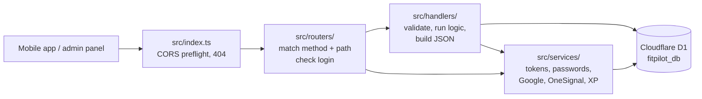

# Folder structure

```
fitpilot-backend/
├── docs/                    this documentation
├── migrations/              numbered SQL migrations for D1 (0001 … 0019)
├── seeds/
│   └── exercises.sql        sample exercise library
├── src/
│   ├── index.ts             worker entry: CORS preflight → routers → 404
│   ├── http.ts              shared helpers used by every router
│   ├── routers/             which code handles each URL, plus login checks
│   │   ├── system.ts        /, /health, /docs, /openapi.json, /test-db
│   │   ├── auth.ts          /auth/*
│   │   ├── profile.ts       /profile
│   │   ├── exercises.ts     /exercises, /exercises/:id
│   │   ├── workouts.ts      /workouts/*, /workouts/sessions/*
│   │   ├── progress.ts      /progress
│   │   ├── notifications.ts /notifications, /notifications/test
│   │   ├── app-version.ts   /app/version
│   │   └── admin/
│   │       ├── index.ts     sends /admin/* to the page routers below
│   │       ├── auth.ts      /admin/setup, /admin/auth/*
│   │       ├── dashboard.ts /admin/dashboard
│   │       ├── users.ts     /admin/users
│   │       ├── analytics.ts /admin/analytics
│   │       ├── workouts.ts  /admin/workouts
│   │       ├── exercises.ts /admin/exercises/*
│   │       ├── notifications.ts /admin/notifications/*
│   │       └── app-versions.ts  /admin/app-versions/*
│   ├── handlers/            request logic and database queries
│   │   ├── auth.ts          register, login, Google sign-in, refresh, logout, me
│   │   ├── profile.ts       read and update profile / onboarding fields
│   │   ├── exercises.ts     exercise list and detail
│   │   ├── workouts.ts      plans, generation, today's workout, sessions, sets, stats
│   │   ├── progress.ts      progress dashboard numbers
│   │   ├── app-version.ts   app version config (public + admin)
│   │   ├── admin.ts         admin dashboard, users, analytics, workouts
│   │   └── admin-exercises.ts  admin exercise CRUD
│   ├── services/            building blocks shared across handlers
│   │   ├── auth.ts          look up the user from a Bearer token
│   │   ├── admin-auth.ts    admin accounts and admin sessions
│   │   ├── password.ts      PBKDF2 password hashing (100,000 iterations)
│   │   ├── google-auth.ts   verify Google ID tokens against Google's public keys
│   │   ├── notifications.ts OneSignal push (one user or everyone)
│   │   └── rewards.ts       XP for completed workouts and streak milestones
│   └── docs/
│       └── openapi.ts       OpenAPI spec and Swagger UI page
├── test/                    Vitest tests (Cloudflare Workers pool)
├── wrangler.jsonc           worker name, D1 binding, dev port 8787
└── worker-configuration.d.ts  generated binding types
```

## How a request flows



1. `index.ts` answers `OPTIONS` preflight requests itself. It then passes the request to each router in turn.
2. A router returns a `Response` if it owns the path, or `null` so the next router can try. If every router returns `null`, `index.ts` sends a 404.
3. The router checks login with `requireUser()` or `requireAdmin()` where needed, then calls a handler.
4. The handler validates input, queries D1 and returns the JSON response.

## routers vs handlers vs services

| Folder | Answers | Talks to the database? |
| --- | --- | --- |
| `routers/` | Which code runs for this URL? Is the caller allowed? | Rarely; only small inline queries such as the notification lists |
| `handlers/` | What does this endpoint do? | Yes |
| `services/` | Reusable pieces: tokens, password hashing, external APIs, rewards | Session lookups and reward inserts |

Keeping routing separate means you can see every path and every login check without reading business logic. Handlers don't depend on how they were reached, so they are easier to test.

## Shared helpers in `src/http.ts`

| Helper | Use |
| --- | --- |
| `json(data, status)` | JSON response with CORS headers |
| `requireUser(request, env)` | User ID string, or a 401 `Response` to return as-is |
| `requireAdmin(request, env)` | Admin record, or a 401 `Response` to return as-is |
| `readPagination(url, defaultLimit)` | `{ page, limit, offset }` from `?page` and `?limit` (limit capped at 100) |
| `combineRouters(...routers)` | Tries routers in order, returns the first response |

## Adding an endpoint

1. Write the logic as a function in the matching file in `src/handlers/`, for example `export async function getBadges(request, env)`.
2. Add the path to the matching router in `src/routers/`. Add the path to the comment at the top of that file too.
3. For a new area, create `src/routers/<area>.ts` exporting a `Router`, and add it to the list in `src/index.ts`. For a new admin page, add it to `src/routers/admin/index.ts` instead.
4. Document it in `src/docs/openapi.ts` so it shows up in Swagger.
5. Run `npx tsc --noEmit`.

Inside a router, the order of checks matters when paths overlap. For example, `/workouts/today` must be checked before `/workouts/:id`, or "today" would be read as a plan ID.
